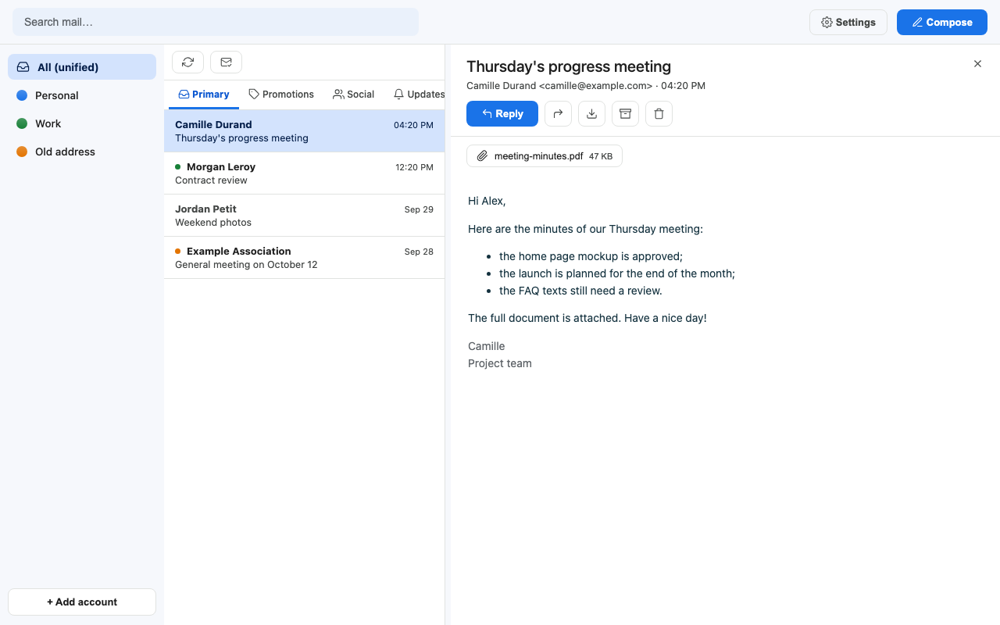
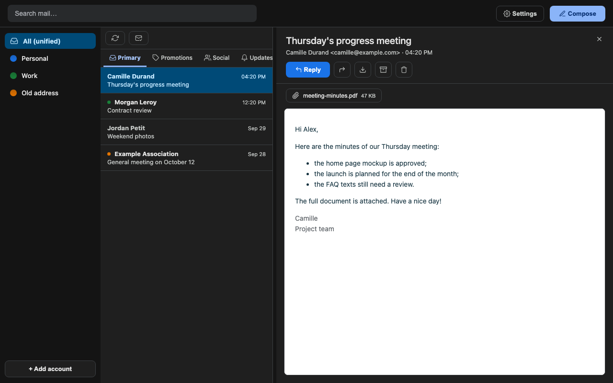
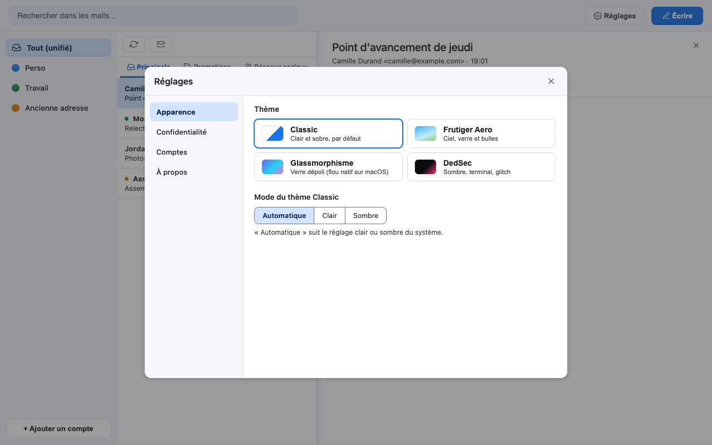
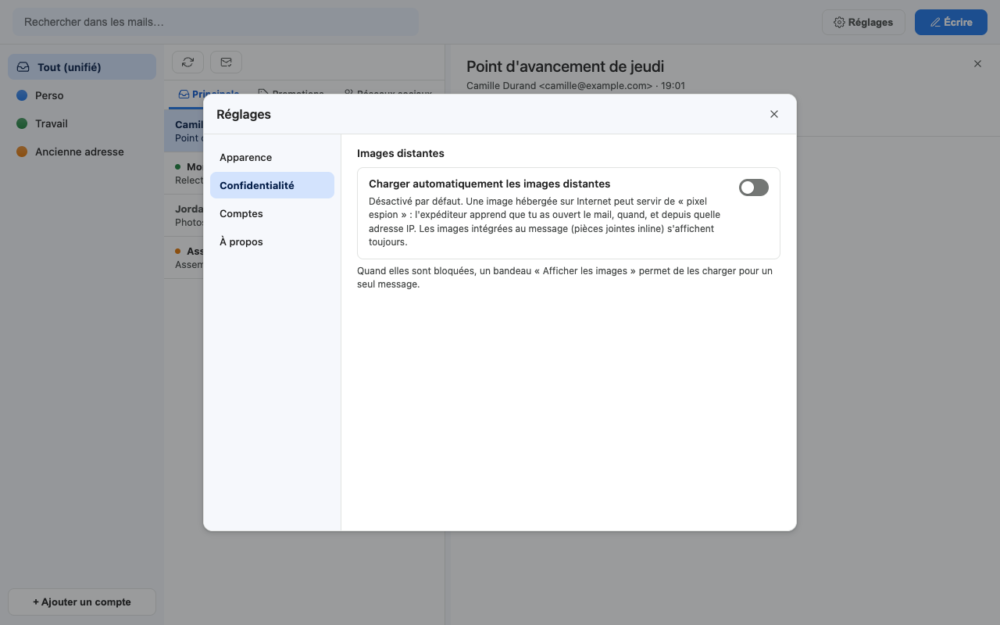
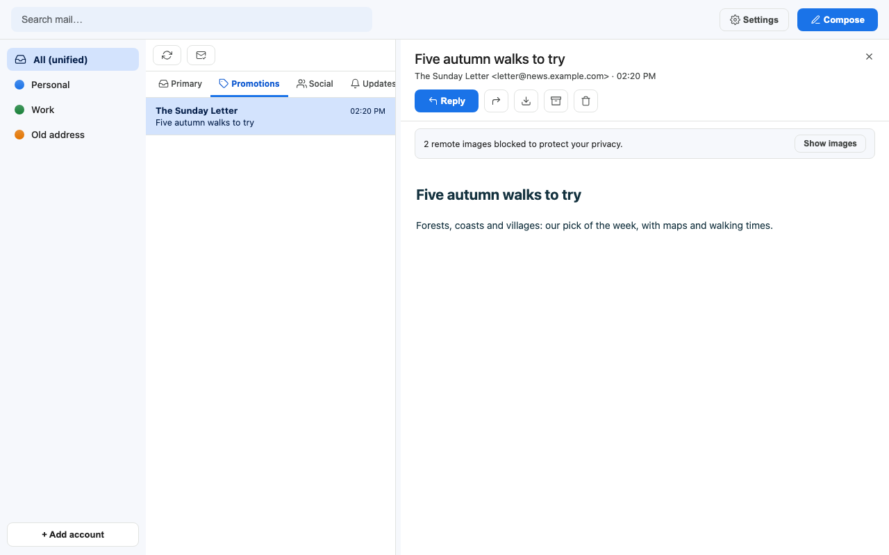
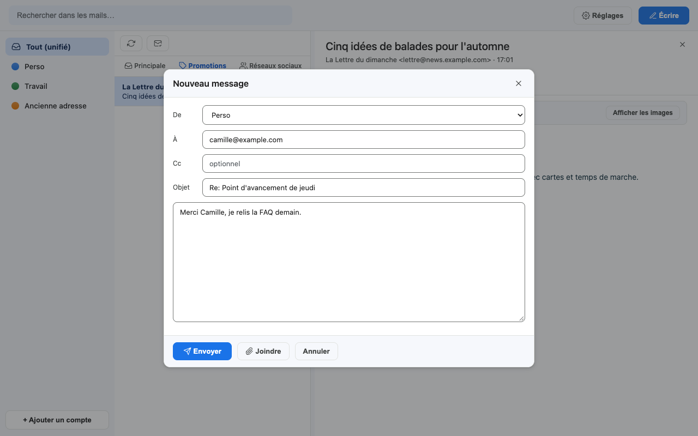
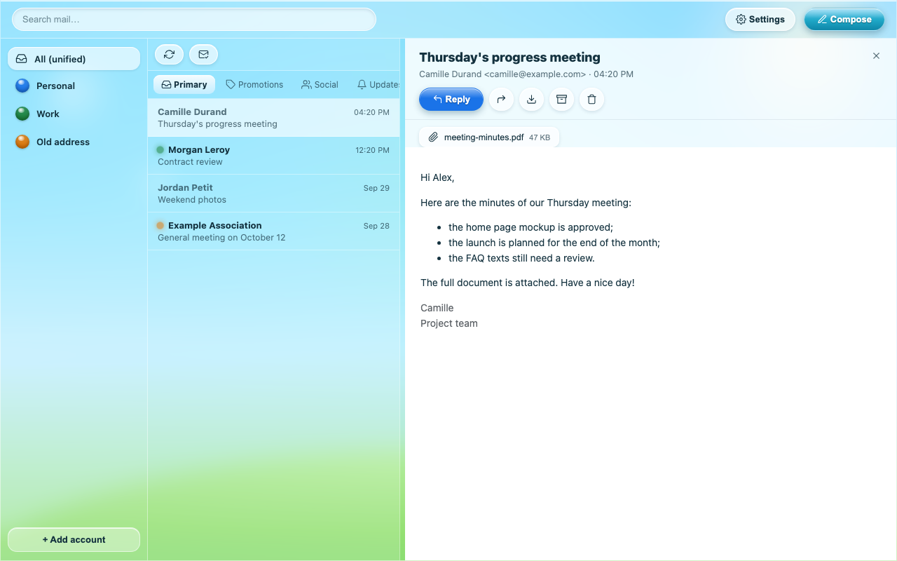
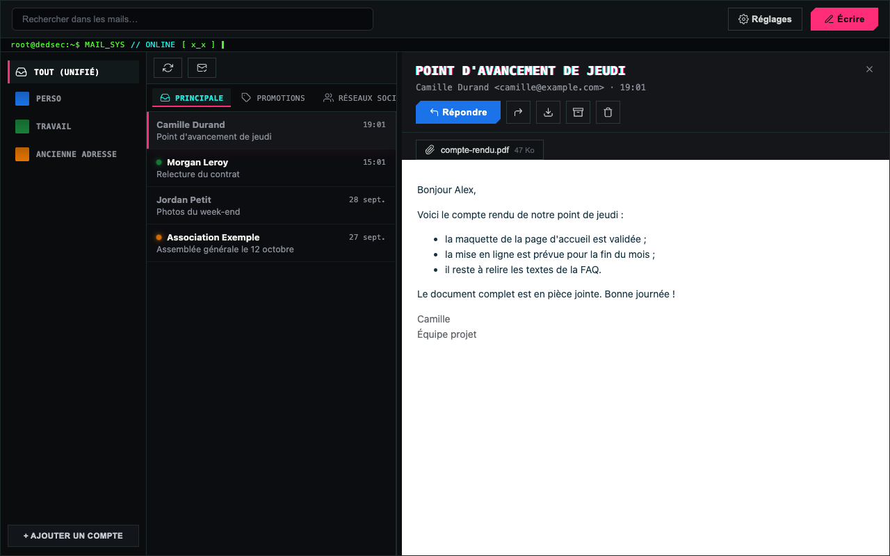

# Maily

**Un client mail local et multi-comptes pour Gmail et IMAP. Tes mails restent sur ton ordinateur.**

[English version](README.md) · [Journal des versions](CHANGELOG.md) · [Sécurité](SECURITY.md) · [Contribuer](CONTRIBUTING.md) · Licence MIT

Maily est un client mail de bureau qui synchronise tes boîtes Gmail / Google Workspace (et, en lecture seule, n'importe quelle boîte IMAP) dans une **base SQLite locale**, puis te permet de lire, chercher, trier et envoyer tes mails depuis une fenêtre claire et sobre. Il n'y a pas de serveur Maily ni de cloud tiers : Maily parle directement à Google (ou à ton serveur IMAP) avec **tes propres** identifiants OAuth, et tout ce qu'il conserve est sur ton disque.

Il est aussi conçu pour être **piloté par des scripts** : un schéma SQL stable en lecture, une API HTTP locale et un serveur [MCP](https://modelcontextprotocol.io/) local permettent à tes automatisations et à des agents IA (par exemple Claude Code) de lire tes mails et d'agir dessus, sur ta machine.



---

## Sommaire

1. [Fonctionnalités](#fonctionnalités)
2. [Captures d'écran](#captures-décran)
3. [Le fonctionnement en une minute](#le-fonctionnement-en-une-minute)
4. [Prérequis](#prérequis)
5. [Installation pas à pas](#installation-pas-à-pas)
6. [Configuration Google : tes propres identifiants](#configuration-google--tes-propres-identifiants)
7. [Lancer Maily](#lancer-maily)
8. [Utiliser Maily](#utiliser-maily)
9. [Où sont tes données](#où-sont-tes-données)
10. [Sécurité et vie privée](#sécurité-et-vie-privée)
11. [Automatisations : SQL, API HTTP et MCP](#automatisations--sql-api-http-et-mcp)
12. [Référence de configuration](#référence-de-configuration)
13. [Dépannage](#dépannage)
14. [FAQ](#faq)
15. [Développement](#développement)
16. [Licence](#licence)

---

## Fonctionnalités

- **Plusieurs boîtes, une seule fenêtre.** Comptes Gmail et Google Workspace côte à côte, avec une boîte unifiée et une vue par compte. Chaque compte a un nom et une couleur.
- **Catégories et libellés Gmail.** Onglets Principale, Promotions, Réseaux sociaux et Notifications ; archiver, corbeille (réversible), tes libellés comme dossiers.
- **Comptes IMAP en lecture seule.** Connecte une boîte IMAP (Orange par défaut, tout serveur IMAP fonctionne) : tous les dossiers sont importés, sans limite de date. Lecture, recherche, pièces jointes, corbeille et export `.eml` fonctionnent ; l'envoi non (pas de SMTP).
- **Affichage HTML sûr.** Les messages sont nettoyés (pas de scripts, pas de liens dangereux, pas de pièges CSS) et affichés dans un cadre isolé (sandbox). Les images intégrées (`cid:`) s'affichent.
- **Pixels espions bloqués par défaut.** Les images distantes ne se chargent pas tant que tu ne l'autorises pas, globalement ou pour un seul message.
- **Écrire, répondre, transférer**, avec pièces jointes (comptes Gmail).
- **Recherche plein texte locale** (SQLite FTS5) dans tous les comptes, instantanée et hors ligne.
- **Onglets de mails.** Cmd/Ctrl + clic ouvre un message dans son propre onglet.
- **Synchronisation automatique** toutes les 3 minutes tant que l'app est ouverte, plus un bouton Synchroniser.
- **Export** de n'importe quel message en fichier `.eml` standard.
- **Quatre thèmes.** *Classic* (par défaut : clair, plat, dans l'esprit de Google, avec une variante sombre), *Frutiger Aero*, *Glassmorphisme* (verre dépoli natif sur macOS) et *DedSec*.
- **Un seul panneau Réglages** pour l'apparence, la confidentialité, les comptes et les informations de l'app.
- **Secrets chiffrés.** Les jetons OAuth et les mots de passe IMAP sont chiffrés au repos, dans des fichiers lisibles par ton seul utilisateur. Sur macOS, l'app peut exiger Touch ID au lancement.
- **Pensé pour l'automatisation.** Vues SQL stables, API HTTP locale protégée par jeton, client Python prêt à l'emploi et serveur MCP local.

## Captures d'écran

| Classic, clair | Classic, sombre |
|---|---|
|  |  |

| Réglages : apparence | Réglages : confidentialité |
|---|---|
|  |  |

| Images distantes bloquées | Écrire un message |
|---|---|
|  |  |

| Thème Frutiger Aero | Thème DedSec |
|---|---|
|  |  |

Toutes les captures utilisent le [mode démonstration](#essayer-sans-compte-google) intégré, avec des données fictives.

## Le fonctionnement en une minute

```
 API Gmail / IMAP  <--- synchro --->  core/ (moteur Python)  --->  app.sqlite (tes mails, en local)
                                          |
                                          +--> api/  API HTTP locale sur 127.0.0.1 (port aléatoire, jeton)
                                          |        ^
                                          |        +--- frontend/ (la fenêtre que tu vois, via pywebview)
                                          |        +--- tes scripts (scripts/claude_client.py)
                                          |
                                          +--> app/mcp_server.py  (MCP en stdio, pour les agents IA)
```

- Le **moteur** (`core/`) est la source de vérité : il synchronise, range dans SQLite, envoie et gère les secrets.
- La **fenêtre** est une petite page web (`frontend/`) affichée par [pywebview](https://pywebview.flowrl.com/) et servie par une API locale liée à `127.0.0.1` uniquement.
- Tes **automatisations** utilisent le même moteur : lire la base, appeler l'API locale, ou passer par le serveur MCP.

Plus de détails dans [docs/ARCHITECTURE.md](docs/ARCHITECTURE.md) (en anglais).

## Prérequis

- **Système :** macOS (Apple Silicon ou Intel) est la plateforme principale et testée. Linux et Windows devraient fonctionner (le code prévoit les deux) mais sont moins testés ; voir [docs/BUILD.md](docs/BUILD.md) pour leurs paquets système.
- **[uv](https://docs.astral.sh/uv/)**, le gestionnaire de paquets Python. Il installe le bon Python (3.12) et toutes les dépendances à ta place.
- **git**, pour récupérer le code.
- **Un compte Google** et une dizaine de minutes pour créer tes identifiants OAuth gratuits (seulement pour les comptes Gmail ; l'IMAP ne demande que le mot de passe de la boîte).

Aucun compte payant, aucun serveur, aucune carte bancaire.

## Installation pas à pas

### 1. Installer uv

macOS et Linux :

```bash
curl -LsSf https://astral.sh/uv/install.sh | sh
```

Windows (PowerShell) :

```powershell
powershell -ExecutionPolicy ByPass -c "irm https://astral.sh/uv/install.ps1 | iex"
```

Les autres méthodes (Homebrew, pipx, ...) sont dans la [documentation d'uv](https://docs.astral.sh/uv/getting-started/installation/). Ouvre ensuite un nouveau terminal et vérifie avec `uv --version`.

### 2. Récupérer Maily

```bash
git clone https://github.com/ThanaelFontaine/fetch-multi-mail-viewer-sender.git maily
cd maily
```

### 3. Installer Python et les dépendances

```bash
uv python install 3.12
uv sync
```

`uv sync` crée un environnement virtuel privé dans `.venv/`, dans le dossier du projet. Rien n'est installé sur le système.

### 4. Vérifier que tout marche

```bash
uv run pytest
```

Tous les tests doivent passer. Ils ne touchent jamais tes vraies données (chaque test reçoit un dossier temporaire).

### Essayer sans compte Google

Envie de faire le tour d'abord ? Le mode démonstration lance l'interface sur des boîtes fictives, dans un dossier temporaire, sans réseau et sans toucher à aucune donnée ni aucun secret réels :

```bash
uv run python scripts/demo.py
```

Ouvre l'adresse affichée (par exemple `http://127.0.0.1:53817/`) dans ton navigateur. L'envoi et la synchronisation sont désactivés ; marquer comme lu, archiver et mettre à la corbeille ne touchent que la base de démonstration. Ctrl+C pour arrêter.

## Configuration Google : tes propres identifiants

Maily suit le modèle « bring your own credentials » (comme rclone ou GAM) : **tu** crées un petit projet Google Cloud gratuit et un client OAuth de type *Application de bureau*. Maily se connecte ensuite à Gmail en ton nom. Conséquences :

- pas d'identifiants Maily partagés : tu ne fais confiance qu'à Google et à ta propre machine ;
- Google affiche un écran « application non vérifiée » la première fois. C'est normal : c'est **ton** app. Clique *Paramètres avancés*, puis *Accéder à Maily (non sécurisé)*.

Le guide complet, avec chaque écran de la console Google Cloud expliqué, est dans **[docs/fr/GOOGLE_CLOUD_SETUP.md](docs/fr/GOOGLE_CLOUD_SETUP.md)**. En résumé :

1. Crée un projet Google Cloud et active l'**API Gmail**.
2. Configure l'écran de consentement : type d'utilisateur **External**, puis **Publish app** (en mode « Testing », Google fait expirer la connexion au bout de 7 jours).
3. Crée un client OAuth de type **Desktop app** et télécharge son fichier JSON.
4. Confie ce fichier à Maily (le secret est chiffré, jamais affiché) :

   ```bash
   uv run python scripts/store_client_config.py ~/Downloads/client_secret_XXXX.json
   ```

   Tu peux ensuite supprimer le JSON téléchargé.

5. Ajoute tes boîtes, depuis l'app (**+ Ajouter un compte** en bas à gauche, puis *Compte Google*) ou depuis le terminal :

   ```bash
   uv run python scripts/connect_account.py
   ```

   Ton navigateur s'ouvre sur l'écran de consentement Google. Répète pour chaque adresse.

Maily demande deux autorisations Gmail : `gmail.modify` (lire, étiqueter, archiver, mettre à la corbeille) et `gmail.send` (envoyer). Il ne supprime jamais un message définitivement.

### Comptes IMAP (lecture seule)

Dans l'app : **+ Ajouter un compte**, puis *Adresse IMAP*. Saisis l'adresse et le mot de passe ; le serveur est Orange par défaut (`imap.orange.fr`, port 993, TLS) et se change sous *Serveur IMAP*. Maily teste la connexion avant d'enregistrer quoi que ce soit. Le mot de passe est rangé chiffré, comme les jetons OAuth. Certains fournisseurs exigent un « mot de passe d'application » au lieu du mot de passe habituel : consulte leur aide.

## Lancer Maily

Depuis le dossier du projet :

```bash
uv run python -m app.bootstrap
```

Sur macOS, si Touch ID est configuré, le système te demande d'abord de déverrouiller Maily (le mot de passe de session fonctionne aussi). La fenêtre s'ouvre ensuite et une première synchronisation démarre en arrière-plan : la première fois, Maily télécharge les 12 derniers mois de chaque boîte Gmail (réglable) et tous les dossiers IMAP. Pour une grosse boîte, cela peut prendre un moment ; la liste se remplit au fur et à mesure.

Options utiles :

```bash
uv run python -m app.bootstrap --data-dir /chemin/vers/un/dossier   # autre dossier de données
MAILY_NO_BIOMETRIC=1 uv run python -m app.bootstrap                 # sans la porte Touch ID
```

Pour construire une application à double-cliquer (`Maily.app`, ou un exécutable sous Linux et Windows), voir [docs/BUILD.md](docs/BUILD.md).

## Utiliser Maily

- **Colonne de gauche :** *Tout (unifié)*, puis une entrée par compte. Clique sur la pastille de couleur d'un compte pour la changer. Quand un compte est sélectionné, ses dossiers (*Boîte de réception*, *Archivés*, *Corbeille*) et ses *Libellés* apparaissent dessous. **+ Ajouter un compte** est épinglé en bas.
- **Colonne du milieu :** la liste des messages, avec les onglets de catégories Gmail. Les deux petits boutons : *Synchroniser* et *Tout marquer lu*. Fais glisser le séparateur pour redimensionner.
- **Colonne de droite :** le message ouvert, avec *Répondre*, transférer, télécharger le `.eml`, archiver et corbeille. Cmd/Ctrl + clic sur un message l'ouvre dans un onglet.
- **Champ de recherche :** recherche plein texte dans la base locale, sur tous les comptes ou le compte sélectionné.
- **Écrire :** nouveau message. Le bouton *Envoyer* prend la couleur du compte expéditeur choisi.
- **Réglages** (roue dentée, en haut à droite), quatre onglets :
  - *Apparence :* thème (Classic, Frutiger Aero, Glassmorphisme, DedSec) ; pour Classic, *Automatique* (suit le système), *Clair* ou *Sombre* ; pour Glassmorphisme, la densité du fond dépoli (macOS).
  - *Confidentialité :* charger automatiquement les images distantes ou non (désactivé par défaut).
  - *Comptes :* nom affiché, couleur, et *Déconnecter* (supprime les secrets du compte et sa copie locale des mails ; le reconnecter les retélécharge).
  - *À propos :* version, dossier des données, licence.
- **Échap** ferme la fenêtre ouverte.

Tes choix sont mémorisés d'un lancement à l'autre (ils sont rangés dans `prefs.json`, dans le dossier de données).

## Où sont tes données

Tout est dans un seul dossier :

| Plateforme | Dossier par défaut |
|---|---|
| macOS | `~/Library/Application Support/Maily/` |
| Windows | `%APPDATA%\Maily\` |
| Linux | `$XDG_DATA_HOME/maily/`, ou `~/.local/share/maily/` |

Définis `MAILY_DATA_DIR` (ou passe `--data-dir`) pour utiliser un autre dossier. Le dossier contient :

| Fichier ou dossier | Contenu |
|---|---|
| `app.sqlite` (+ `-wal`, `-shm`) | Tes messages, comptes, libellés, état de synchro, index plein texte |
| `attachments/` | Pièces jointes déjà ouvertes (cache local) |
| `secrets.enc` | Secrets chiffrés : client OAuth, jetons OAuth, mots de passe IMAP, jeton de l'API locale |
| `secrets.key` | La clé qui déchiffre `secrets.enc` |
| `secrets.lock` | Fichier de verrou qui sérialise les écritures concurrentes des secrets |
| `prefs.json` | Préférences de l'interface : thème, mode Classic, images distantes, largeur de la liste |
| `runtime.json` | Adresse, port et jeton d'API de l'app en cours (pour tes scripts) |
| `logs/` | Journaux, jetons et mots de passe masqués |
| `webview/` | Stockage de la fenêtre utilisé par pywebview sur certaines plateformes (rien d'important) |

Le dossier et les fichiers secrets ne sont lisibles que par ton utilisateur (permissions `0700` / `0600` sur macOS et Linux). **Sauvegarde** ce dossier si tu veux garder ta copie locale ; attention, quiconque récupère à la fois `secrets.enc` et `secrets.key` peut lire tes jetons : traite une sauvegarde comme un mot de passe.

Pour repartir de zéro, quitte Maily et supprime le dossier. Pour retirer l'accès de Maily côté Google, va sur la [page des connexions tierces](https://myaccount.google.com/connections) de ton compte Google.

## Sécurité et vie privée

Version courte (détails et modèle de menace dans [SECURITY.md](SECURITY.md), en anglais) :

- **Tout en local.** Pas de serveur Maily. L'API locale n'écoute que sur `127.0.0.1`, sur un port aléatoire, exige un jeton aléatoire et refuse les requêtes dont l'en-tête `Host` n'est pas local (protection contre le DNS rebinding).
- **Secrets chiffrés.** Jetons et mots de passe sont chiffrés avec Fernet (AES-128-CBC + HMAC-SHA256) dans `secrets.enc` ; la clé est dans `secrets.key` ; les deux sont en `0600`. Les écritures sont atomiques et verrouillées entre processus, et un magasin illisible lève une erreur claire au lieu d'être écrasé en silence. Le chiffrement au repos protège des copies fortuites ; il ne protège pas d'un logiciel malveillant qui tourne sous ton utilisateur et pourrait lire les deux fichiers. Le chiffrement du disque (FileVault, BitLocker, LUKS) est recommandé.
- **Porte Touch ID** (macOS, facultative) : la fenêtre ne s'ouvre qu'après Touch ID ou ton mot de passe de session. Le serveur MCP et les scripts ne la demandent pas, volontairement, pour que les automatisations locales fonctionnent.
- **HTML nettoyé.** Les messages passent par [nh3](https://github.com/messense/nh3) (`ammonia` en Rust) : pas de scripts, pas de liens `javascript:` ou `data:`, CSS filtré, puis un iframe isolé.
- **Pixels espions.** Les images distantes sont bloquées par défaut ; un bandeau indique combien l'ont été et permet de les charger pour un seul message.
- **Moindre privilège sur Gmail.** `gmail.modify` et `gmail.send` uniquement ; les messages vont à la corbeille, jamais supprimés définitivement.

Tu as trouvé une faille ? Signale-la en privé, voir [SECURITY.md](SECURITY.md).

## Automatisations : SQL, API HTTP et MCP

Maily est fait pour être piloté par tes propres outils. Trois niveaux, du plus simple au plus riche :

### 1. Lire la base (sans l'app)

Ouvre `app.sqlite` en lecture seule et utilise les **vues stables**, dont les colonnes ne changeront pas d'une version à l'autre :

- `v1_accounts` (id, email, display_name, status, last_sync_at)
- `v1_messages` (id, account_id, gmail_id, thread_id, direction, addr_from, addr_to, addr_cc, subject, snippet, body_text, internal_date, is_unread, is_starred, has_attachments, is_trashed), messages à la corbeille exclus
- `v1_threads` (id, account_id, gmail_thread_id, subject, last_message_at, message_count)

```bash
sqlite3 -readonly "$HOME/Library/Application Support/Maily/app.sqlite" \
  "SELECT datetime(internal_date/1000,'unixepoch'), addr_from, subject FROM v1_messages ORDER BY internal_date DESC LIMIT 10;"
```

Les tables autres que `v1_*` sont internes et peuvent changer.

### 2. L'API HTTP locale (app lancée)

Quand l'app tourne, `runtime.json` donne `base_url` et `token`. Chaque appel exige `Authorization: Bearer <token>`. Principaux points d'entrée : `GET /accounts`, `GET /messages`, `GET /messages/{id}`, `GET /messages/{id}/html`, `GET /search?q=...`, `POST /send`, `POST /messages/{id}/modify`, `POST /messages/{id}/trash`, `POST /messages/{id}/untrash`, `POST /accounts/{id}/sync`, `GET /messages/{id}/eml`. La liste complète est dans [docs/ARCHITECTURE.md](docs/ARCHITECTURE.md#local-http-api).

Un client prêt à l'emploi s'occupe de la plomberie :

```bash
uv run python scripts/claude_client.py accounts
uv run python scripts/claude_client.py inbox --account 1
uv run python scripts/claude_client.py read 42
uv run python scripts/claude_client.py send --account 1 --to quelquun@example.com --subject "Bonjour" --body "Salut !"
```

Il s'importe aussi : `from scripts.claude_client import accounts, messages, read_message, search, send, sync`.

### 3. Le serveur MCP (pour les agents IA)

`app/mcp_server.py` expose Maily en outils MCP via **stdio** (aucun port réseau) : `maily_list_accounts`, `maily_list_messages`, `maily_get_message`, `maily_search`, `maily_sync`, `maily_send`, `maily_export_eml`, `maily_download_attachment`, `maily_trash`. Il fonctionne sans que l'app soit ouverte.

Le dépôt fournit un [`.mcp.json`](.mcp.json) : ouvre une session Claude Code dans le dossier du projet et approuve le serveur `maily` (ou tape `/mcp`). Pour Claude Desktop ou un autre client MCP, et pour les règles de sécurité recommandées (confirmer avant d'envoyer ou de mettre à la corbeille), voir **[docs/fr/MCP.md](docs/fr/MCP.md)**.

## Référence de configuration

Variables d'environnement (ou fichier `.env` dans le dossier depuis lequel tu lances, voir [`.env.example`](.env.example)) :

| Variable | Défaut | Rôle |
|---|---|---|
| `MAILY_DATA_DIR` | dossier de la plateforme | Dossier des données (comme `--data-dir`) |
| `MAILY_POLL_INTERVAL_SECONDS` | `180` | Intervalle de synchro automatique, app ouverte (minimum 60) |
| `MAILY_BACKFILL_MONTHS` | `12` | Mois d'historique Gmail téléchargés à la première synchro |
| `MAILY_ATTACHMENT_CACHE_MB` | `500` | Taille du cache des pièces jointes (réservé, pas encore appliqué) |
| `MAILY_LOG_LEVEL` | `INFO` | `DEBUG`, `INFO`, `WARNING` ou `ERROR` |
| `MAILY_NO_BIOMETRIC` | non défini | `1` pour sauter la porte Touch ID |

## Dépannage

**« Identifiants client (client_id/secret) absents » en ajoutant un compte Google.**
Le client OAuth n'est pas encore enregistré. Lance `uv run python scripts/store_client_config.py chemin/vers/client_secret.json`, puis réessaie.

**Google affiche « Accès bloqué » ou « Cette application est bloquée ».**
Vérifie que le type d'utilisateur de l'écran de consentement est *External* et que l'API Gmail est activée. Pour un compte Google Workspace, l'administrateur doit peut-être autoriser l'app dans la console d'administration (*Sécurité > Commandes des API > Gérer l'accès des applications tierces*, par Client ID). Voir [docs/fr/GOOGLE_CLOUD_SETUP.md](docs/fr/GOOGLE_CLOUD_SETUP.md#dépannage).

**Je dois me reconnecter chaque semaine.**
Ton écran de consentement est encore en *Testing* : dans ce mode, Google délivre des jetons qui expirent au bout de 7 jours. Publie l'app (*Audience > Publish app*), puis reconnecte le compte une fois.

**« Maily ne peut pas demarrer : Impossible de dechiffrer ... » au lancement.**
`secrets.enc` ne se déchiffre pas avec `secrets.key` (la clé a été remplacée, ou un fichier est abîmé). Maily s'arrête sans rien modifier. Restaure les deux fichiers depuis une sauvegarde si tu en as une ; sinon supprime `secrets.enc` et `secrets.key` et reconnecte tes comptes (tes mails dans `app.sqlite` sont conservés).

**La fenêtre reste vide ou dit ne pas joindre l'API locale.**
Lance depuis un terminal pour voir l'erreur : `uv run python -m app.bootstrap`. Regarde les journaux dans le dossier `logs/` du dossier de données.

**Les images distantes ne s'affichent pas.**
C'est le réglage par défaut, pour ta vie privée. Clique *Afficher les images* au-dessus du message, ou active *Charger automatiquement les images distantes* dans *Réglages > Confidentialité*.

**Le thème Glassmorphisme est opaque.**
Le flou natif demande macOS avec *Réglages Système > Accessibilité > Affichage > Réduire la transparence* désactivé. Sous Linux et Windows, ce thème n'a pas de flou natif.

**Linux : la fenêtre ne s'ouvre pas.**
pywebview a besoin de GTK et WebKit2GTK (ou de Qt). Installe les paquets listés dans [docs/BUILD.md](docs/BUILD.md#linux-x86_64).

**Les outils MCP n'apparaissent pas dans Claude Code.**
Le serveur doit être approuvé : tape `/mcp` dans Claude Code. Voir [docs/fr/MCP.md](docs/fr/MCP.md#dépannage).

## FAQ

**Maily envoie-t-il mes mails quelque part ?**
Non. Il ne parle qu'aux API de Google (comptes Gmail) et à ton serveur IMAP. Pas de serveur Maily, pas de statistiques d'usage, pas de télémétrie.

**Pourquoi faut-il mon propre projet Google Cloud ?**
Les autorisations Gmail sont des scopes « restreints » : un client OAuth public et partagé devrait passer la vérification de Google, avec un audit de sécurité payant par un tiers. Avec ton propre client, l'app est à toi, c'est gratuit, et personne d'autre ne détient d'accès à tes mails.

**Mon projet Google Cloud est-il gratuit ?**
Oui pour cet usage : activer l'API Gmail et créer un client OAuth ne coûte rien et ne demande aucun compte de facturation.

**Puis-je utiliser une adresse @gmail.com classique ?**
Oui. Comptes Gmail et Google Workspace peuvent être mélangés. Choisis *External* sur l'écran de consentement pour que tous tes comptes puissent se connecter.

**Pourquoi ne puis-je pas envoyer depuis un compte IMAP ?**
L'IMAP ne sert qu'à lire. L'envoi demanderait le SMTP, que Maily n'implémente pas encore. Les contributions sont bienvenues.

**Maily peut-il supprimer mes mails pour de bon ?**
Non. *Corbeille* déplace le message à la corbeille (réversible, et Gmail vide lui-même sa corbeille au bout de 30 jours). *Déconnecter* ne supprime que la copie locale et les secrets de Maily ; ta boîte n'est pas touchée.

**Ça marche hors ligne ?**
Lire et chercher ce qui est déjà synchronisé fonctionne hors ligne. La synchro et l'envoi demandent une connexion.

**L'interface existe-t-elle en anglais ?**
Pas encore : elle est en français aujourd'hui. Les traductions sont une contribution bienvenue (voir [CONTRIBUTING.md](CONTRIBUTING.md)).

**Des agents IA peuvent-ils lire mes mails ?**
Seulement si tu le mets en place : le serveur MCP ne tourne que lorsque ton client MCP le lance, sur ta machine. Voir [docs/fr/MCP.md](docs/fr/MCP.md) pour les règles de sécurité.

## Développement

```bash
uv sync                           # dépendances, dont le groupe dev (pytest, httpx)
uv run pytest                     # toute la suite de tests
uv run python scripts/demo.py     # l'interface sur des données fictives
```

Le frontend est en HTML, CSS et JavaScript simples (aucune étape de build) : modifie `frontend/` et recharge. L'organisation du projet, les conventions et le processus de version sont décrits dans [CONTRIBUTING.md](CONTRIBUTING.md) et [docs/ARCHITECTURE.md](docs/ARCHITECTURE.md) (en anglais).

## Licence

[MIT](LICENSE), © 2026 Thanaël Fontaine.
