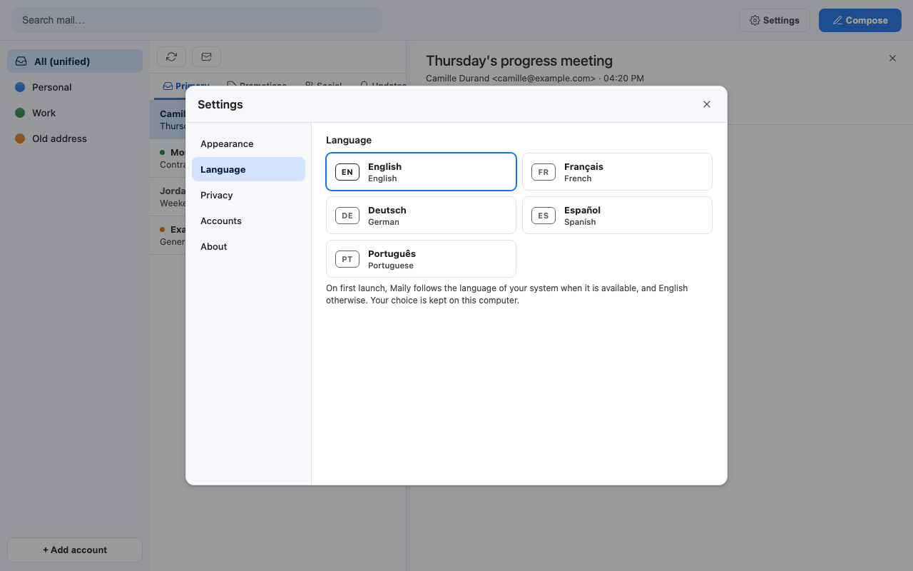
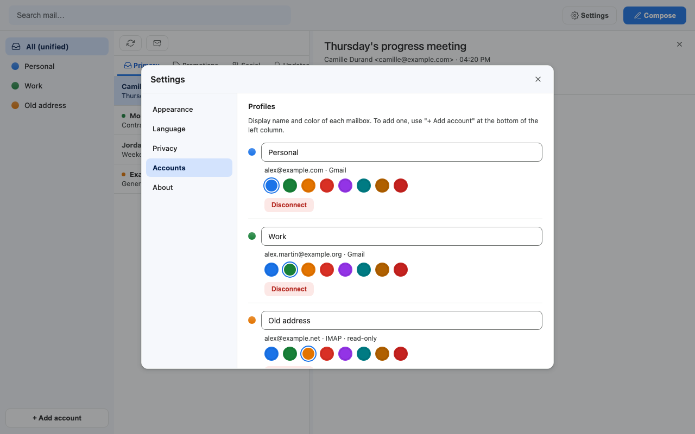
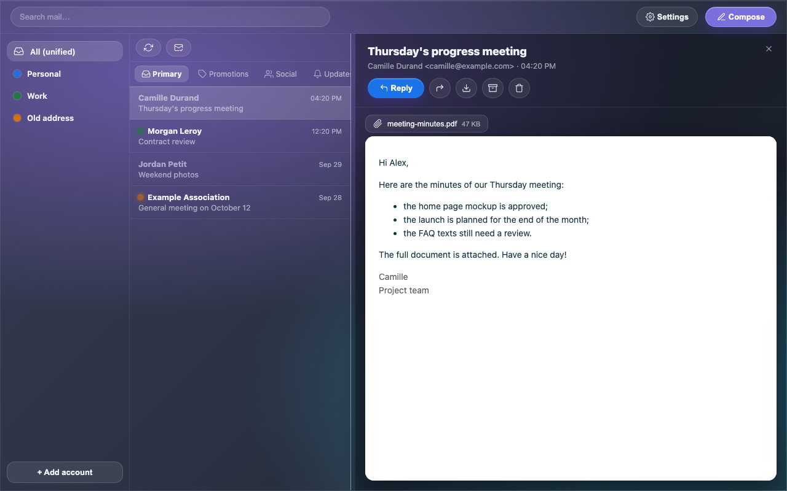
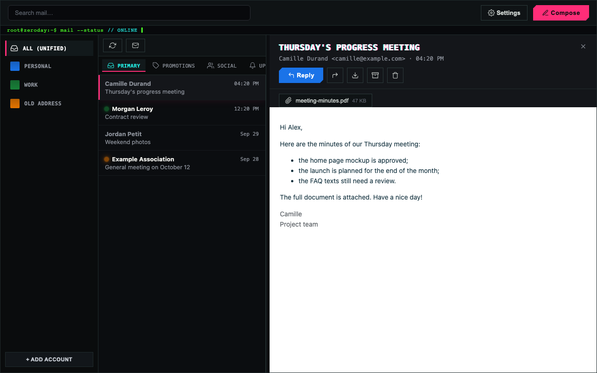

# Maily

[](LICENSE)
[](CHANGELOG.md)
[](#install)

**Every mailbox in one app, and your AI assistant in all of them. Your mail stays on your computer.**

Maily is a free, open source desktop mail app. It brings your Gmail, Google Workspace and IMAP accounts together in one clean inbox, keeps a copy of your mail in a local database, and ships a local [MCP](https://modelcontextprotocol.io/) server so that Claude (or any local MCP client) can read, search and act across **all** your accounts, with no extra cloud in between.

[Website](https://maily.thanaelfontaine.eu) · [Download for macOS](https://github.com/ThanaelFontaine/Maily/releases/latest) · [Changelog](CHANGELOG.md) · [Security](SECURITY.md) · [Contributing](CONTRIBUTING.md)


> **Quick start.** Download `Maily-X.Y.Z-macos-arm64.zip` from the [latest release](https://github.com/ThanaelFontaine/Maily/releases/latest), or run it from source:
>
> ```bash
> git clone https://github.com/ThanaelFontaine/Maily
> cd Maily
> uv sync
> uv run maily
> ```
>
> Then [connect your accounts](#connect-your-accounts) and, if you like, [add Maily to Claude](#use-maily-with-claude-mcp).

---

## Table of contents

1. [Why Maily](#why-maily)
2. [Features](#features)
3. [Screenshots](#screenshots)
4. [How it works](#how-it-works)
5. [Install](#install)
6. [Connect your accounts](#connect-your-accounts)
7. [Use Maily with Claude (MCP)](#use-maily-with-claude-mcp)
8. [A tour of the window](#a-tour-of-the-window)
9. [Where your data lives](#where-your-data-lives)
10. [Security and privacy](#security-and-privacy)
11. [Beyond MCP: SQL views and the local API](#beyond-mcp-sql-views-and-the-local-api)
12. [Configuration reference](#configuration-reference)
13. [Troubleshooting](#troubleshooting)
14. [FAQ](#faq)
15. [Contributing](#contributing)
16. [License](#license)

---

## Why Maily

More and more people ask an AI assistant to sort, summarize and answer their mail. The hosted connectors that make this possible come with trade-offs:

- **One account at a time.** Anthropic's help center says that Claude "can only access the Gmail, Calendar, and Drive data for the Google account you've connected" ([source](https://support.claude.com/en/articles/10166901-use-google-workspace-connectors)). If your mail is spread over a personal address, a work address and an IMAP provider, a Gmail connector cannot see the whole picture.
- **Another cloud reaches your mailbox.** With a hosted connector, the provider's servers fetch your mail for the assistant. Anthropic states that data retrieved through its connectors is stored on its servers ([source](https://support.claude.com/en/articles/10166901-use-google-workspace-connectors)). Check which Google permissions a hosted Gmail connection asks for on its consent screen: a scope such as `gmail.modify` lets it read, compose and send email ([Google's description](https://developers.google.com/workspace/gmail/api/auth/scopes)).
- **Limited actions.** Connectors only do what their provider has built. Anthropic notes, for instance, that with its Gmail connector attachment content is not directly accessible (metadata only) ([source](https://support.claude.com/en/articles/10166901-use-google-workspace-connectors)).

**Maily's answer is local.** Maily syncs every mailbox you add into a database on your own computer, with your own Google credentials. Its MCP server runs on the same computer, started by your assistant as a local process over the stdio transport (the client launches the server as a subprocess and talks to it over standard input and output, see the [MCP specification](https://modelcontextprotocol.io/specification/2025-06-18/basic/transports)). No network port is opened, and no Maily server sits between you and your mail. Your assistant sees every account at once, can read attachments, and can search all your mail instantly, even offline.

One thing stays true with any assistant: what it reads through Maily becomes part of your conversation with it, so it is processed by whoever runs the model behind that assistant. Only connect assistants you trust (see [Security and privacy](#security-and-privacy)).

## Features

### Inbox and accounts

- **Several mailboxes, one window.** Gmail and Google Workspace accounts side by side, plus IMAP accounts (Orange by default, any IMAP server over TLS works).
- **Unified inbox** (*All (unified)*) or one account at a time. Each account has its own display name and color, changed with one click on its colored dot or in *Settings > Accounts*.
- **Gmail categories and labels:** *Primary*, *Promotions*, *Social* and *Updates* tabs; *Inbox*, *Archived*, *Trash* and your own labels as folders.
- **IMAP accounts are read-only:** every IMAP folder is imported, without date limit; reading, search, attachments, trash and `.eml` export work, sending does not (Maily has no SMTP yet).
- **Automatic sync** of every account every 3 minutes while the app is open, plus a *Sync* button.
- **Disconnect** an account in one click: Maily removes its secrets and its local copy; your mailbox on the server is untouched.

### Reading

- **Safe HTML rendering:** messages are sanitized (no scripts, no dangerous links, filtered CSS) and shown in a sandboxed frame. Inline images (`cid:`) are displayed.
- **Attachments** as chips with their size, downloadable in one click.
- **Mail tabs:** Cmd/Ctrl + click opens a message in its own tab.
- **Unread dots** in the account color, *Mark all as read* for the current list, messages marked as read when you open them.
- **Archive, trash, restore from trash, export as `.eml`**, all from the reading pane. For Gmail accounts, trash is reversible: *Restore* brings the message back. For IMAP accounts, Maily cannot restore a trashed message (see [IMAP accounts](#imap-accounts-read-only)).
- **Resizable columns:** drag the separator between the list and the message; Maily remembers the width.

### Writing and sending

- **Compose, Reply** (with the original quoted) and **Forward** (with the original header).
- **From selector** across your Gmail accounts; the *Send* button takes the color of the sending account, so you always know which address is speaking.
- **Attachments** up to 25 MB in total.
- **Never sent twice:** every message goes through an outbox with an idempotency key, so a retry cannot send a duplicate.

### Search

- **Instant local full-text search** (SQLite FTS5) on subject, body and sender, across every account or within the selected one. It works offline.

### Privacy

- **Tracking pixels blocked by default:** remote images are not loaded. A bar says how many were blocked and offers *Show images* for that message; *Settings > Privacy* can load them automatically.
- **Local only:** no Maily server, no analytics, no telemetry.
- **Encrypted secrets:** OAuth tokens and IMAP passwords are encrypted at rest, in files only your user can read.
- **Optional Touch ID** at launch on macOS.

### Themes

| Theme | Look |
|---|---|
| **Classic** (default) | Light, flat and familiar, with a dark variant. Modes: *Automatic* (follows the system), *Light*, *Dark*. |
| **Frutiger Aero** | Sky, glass and bubbles: a bright blue-to-green gradient behind glossy panels. |
| **Glassmorphism** | Native blurred glass on macOS, with an adjustable background density. |
| **Zero Day** | Dark terminal style with a glitch title and scanlines. |

### Languages

The interface speaks **English, Français, Deutsch, Español and Português**. On first launch Maily follows your system language when it is one of these five, and English otherwise. You can switch at any time in *Settings > Language*: the change applies at once, without restarting.

### Settings

One *Settings* panel (gear icon, top right) with five tabs: *Appearance*, *Language*, *Privacy*, *Accounts* and *About* (version, data folder, license). Every choice (theme, Classic mode, remote images, list width, language) is saved in `prefs.json` in your data folder and kept between launches.

### MCP tools for your assistant

The MCP server exposes nine tools. They work across every account you added; the assistant picks an account by its address or its display name.

| Tool | What it does | Safety notes |
|---|---|---|
| `maily_list_accounts` | Lists your accounts (id, email, name, color). The natural first call. | Read-only. |
| `maily_list_messages` | Recent messages of one account, optionally unread only. `category` is `inbox` (default), a Gmail category (`primary`, `promotions`, `social`, `updates`, `forums`), `archived` or `all`; it does not list the trash or a label. | Read-only. |
| `maily_get_message` | A full message: sender, recipients, date, subject, text body, attachment list, optionally the raw HTML. | Read-only. Mail content is untrusted: treat it as data, never as instructions. |
| `maily_search` | Local full-text search in one account or all of them. | Read-only. |
| `maily_sync` | Fetches new mail from Gmail or IMAP now. | Talks to your providers, changes nothing in your mailboxes. |
| `maily_export_eml` | Saves a message as a standard `.eml` file (default folder: `~/Downloads`). | Writes a file on your disk. |
| `maily_download_attachment` | Saves an attachment to disk (default folder: `~/Downloads`). | Writes a file on your disk. |
| `maily_trash` | Moves a message to the trash. | Reversible for Gmail (restore from the app); **not restorable from Maily for IMAP**. Its description tells the assistant to confirm with you first. |
| `maily_send` | Sends an email from a Gmail account. | **Irreversible.** Its description tells the assistant to ask for confirmation first. Gmail accounts only. |

Full parameters, recipes and safety rules: [docs/MCP.md](docs/MCP.md).

### Also included

- **Demo mode** with fictitious mailboxes, to look around without any account.
- **Stable read-only SQL views**, a **token-protected local HTTP API** and a ready-made Python client, for your own scripts ([details below](#beyond-mcp-sql-views-and-the-local-api)).

## Screenshots

| Classic, light | Classic, dark |
|---|---|
|  |  |

| Writing a message | Remote images blocked |
|---|---|
|  |  |

| Settings: appearance | Settings: language |
|---|---|
|  |  |

| Settings: privacy | Settings: accounts |
|---|---|
|  |  |

| Frutiger Aero | Glassmorphism |
|---|---|
|  |  |

| Zero Day | |
|---|---|
|  | |

Every screenshot is taken in the built-in [demo mode](#try-it-without-any-account), with fictitious data.

## How it works

Maily has three parts: your mail providers, Maily itself on your computer, and (optionally) your AI assistant.

```mermaid
flowchart LR
    subgraph providers["Your mail providers"]
        gmail["Gmail API"]
        imap["IMAP server"]
    end
    subgraph computer["Your computer"]
        engine["Sync engine (core/)"]
        db[("SQLite database + FTS5 index")]
        secrets["Encrypted secrets (secrets.enc + secrets.key)"]
        api["Local API on 127.0.0.1 (random port, token)"]
        window["Desktop window (pywebview)"]
        mcp["MCP server (stdio)"]
    end
    assistant["Your assistant (Claude Desktop, Claude Code, MCP clients)"]

    gmail <-->|your own OAuth client| engine
    imap <-->|TLS| engine
    engine --> db
    engine --> secrets
    api --> engine
    window --> api
    assistant -->|starts it as a subprocess| mcp
    mcp --> engine
```



In plain words:

1. **The sync engine** (`core/`, Python) is the heart of Maily. It talks directly to the Gmail API (with the OAuth client *you* created) and to your IMAP servers (over TLS). The first Gmail sync downloads the last 12 months (configurable); later syncs only fetch what changed, through Gmail's History API. IMAP accounts import every folder, then only new messages.
2. **The local database** is a single SQLite file, `app.sqlite`. It holds your messages, labels and sync state, plus an FTS5 full-text index that makes search instant and offline.
3. **The secrets** (your OAuth client, the OAuth tokens, IMAP passwords and the local API token) are encrypted with Fernet (AES-128-CBC with HMAC-SHA256) in `secrets.enc`. **The key lives in `secrets.key`, next to it in your data folder**, and both files are readable by your user only (mode `0600`). Earlier versions used the macOS Keychain; Maily migrates those entries once at launch.
4. **The window** is a small web page (`frontend/`, plain HTML, CSS and JavaScript) shown in a native window by [pywebview](https://pywebview.flowrl.com/). It talks to a **local API** that listens on `127.0.0.1` only, on a random port, and requires a random token.
5. **The MCP server** (`app/mcp_server.py`) uses the same engine, database and secrets. Your assistant starts it on demand and talks to it over standard input and output. It works even when the window is closed.

Where the data folder is:

| Platform | Default data folder |
|---|---|
| macOS | `~/Library/Application Support/Maily/` |
| Windows | `%APPDATA%\Maily\` |
| Linux | `$XDG_DATA_HOME/maily/`, or `~/.local/share/maily/` |

Its full content is described in [Where your data lives](#where-your-data-lives), and the internals in [docs/ARCHITECTURE.md](docs/ARCHITECTURE.md).

## Install

Two ways: the ready-made macOS app, or from source (macOS, and Linux or Windows with less testing). The MCP server for your assistant always runs from a source folder, so if you plan to use Maily with Claude, the source install is the one you need (the downloaded app and the source version share the same data).

### Option A: download the macOS app (Apple Silicon)

1. Open the [latest release](https://github.com/ThanaelFontaine/Maily/releases/latest) and download two files: `Maily-X.Y.Z-macos-arm64.zip` and `Maily-X.Y.Z-macos-arm64.zip.sha256`.
2. Optional but recommended, check the download in Terminal, from the folder that holds both files:

   ```bash
   shasum -a 256 -c Maily-X.Y.Z-macos-arm64.zip.sha256
   ```

   It prints `Maily-X.Y.Z-macos-arm64.zip: OK`.
3. Double-click the zip, then move `Maily.app` to your *Applications* folder.
4. **Open it the first time.** The app is free and open source, but it is not signed with an Apple Developer ID nor notarized, so macOS blocks it on first launch. Apple's official steps ([Open a Mac app from an unknown developer](https://support.apple.com/guide/mac-help/open-a-mac-app-from-an-unknown-developer-mh40616/mac)):
   1. Try to open `Maily.app` once, and close the warning.
   2. Choose Apple menu > *System Settings*, then click *Privacy & Security* in the sidebar.
   3. Go to *Security*, then click *Open Anyway* next to the message about Maily. Apple notes that this button is available for about an hour after you try to open the app.
   4. Enter your login password, then click *OK*.

   macOS remembers the exception, and Maily opens normally from then on. If you prefer not to run an unsigned binary, use option B. More details, including the command-line alternative, in [docs/BUILD.md](docs/BUILD.md#downloading-the-macos-app).

To **update**, download the new zip from the latest release and replace `Maily.app`. Your accounts and mail stay in the data folder.

### Option B: run from source

**Prerequisites**

- **git**.
- **[uv](https://docs.astral.sh/uv/)**, the Python package manager. It installs the right Python (3.12) and every dependency for you, inside the project folder. Install it with one of these commands ([uv documentation](https://docs.astral.sh/uv/getting-started/installation/)):
  - macOS and Linux: `curl -LsSf https://astral.sh/uv/install.sh | sh`
  - macOS with Homebrew: `brew install uv`
  - Windows (PowerShell): `powershell -ExecutionPolicy ByPass -c "irm https://astral.sh/uv/install.ps1 | iex"`

  Open a new terminal afterwards and check with `uv --version`.
- **Linux only:** pywebview needs GTK and WebKit2GTK; the packages are listed in [docs/BUILD.md](docs/BUILD.md#linux-x86_64).

**Install and launch**

```bash
git clone https://github.com/ThanaelFontaine/Maily
cd Maily
uv sync          # creates .venv/ in the folder, with Python 3.12 and every dependency
uv run maily     # launches Maily
```

**`uv run maily` is the launch command.** Run it from the `Maily` folder each time you want to open the app (`uv run python -m app.bootstrap` does the same).

What happens at launch: on macOS, if Touch ID is set up, the system asks you to unlock Maily first (your session password works too). Then the window opens and a first sync starts in the background. The first time, it downloads the last 12 months of each Gmail mailbox and all IMAP folders; for big mailboxes this takes a while, and the list fills in as it goes.

Useful options:

```bash
uv run maily --data-dir /path/to/folder    # use another data folder (same as MAILY_DATA_DIR)
MAILY_NO_BIOMETRIC=1 uv run maily          # skip the Touch ID gate
uv run maily --help                        # list the options
```

**To stop Maily**, close its window: the local API and the automatic sync stop with it.

**To update** a source install:

```bash
cd Maily
git pull
uv sync
uv run maily
```

Your data folder is kept; if the new version changes the database schema, Maily applies the migration by itself at launch.

**To check your install** (optional), run the test suite. It never touches your real data:

```bash
uv run pytest
```

### Try it without any account

The demo mode starts the interface on fictitious mailboxes, in a temporary folder, without network access and without touching any real data or secret:

```bash
uv run python scripts/demo.py
```

Open the address it prints (for example `http://127.0.0.1:53817/`) in your browser. Sending and syncing are disabled; marking as read, archiving and trashing only affect the demo database. Press Ctrl+C in the terminal to stop it.

### Build the app yourself

To build a double-clickable `Maily.app` (or an executable on Linux and Windows) with PyInstaller, see [docs/BUILD.md](docs/BUILD.md).

## Connect your accounts

### Google accounts (Gmail and Google Workspace)

Maily ships no Google credentials. It uses the "bring your own credentials" model: **you** create a small Google Cloud project and an OAuth client of type *Desktop app*, once, and Maily connects to Gmail with it. Nobody but you holds a key to your mailbox, and there is no third party in between.

The complete walkthrough, screen by screen, is in **[docs/GOOGLE_CLOUD_SETUP.md](docs/GOOGLE_CLOUD_SETUP.md)** (about 10 minutes). In short:

1. In the [Google Cloud console](https://console.cloud.google.com/), create a project and enable the **Gmail API**.
2. In *Google Auth Platform*, set the audience (user type) to **External**, so that any of your Google accounts can connect.
3. Under *Audience*, either add every address you will connect as a **test user**, or click **Publish app**. Publishing is recommended: Google states that an External app in *Testing* status is issued refresh tokens that expire after 7 days ([source](https://developers.google.com/identity/protocols/oauth2)), which would force you to reconnect every week. Publishing does not list your app anywhere: each mailbox still has to be connected by its owner.
4. Under *Clients*, create an OAuth client of type **Desktop app** and download its JSON file.
5. Give that file to Maily, from the `Maily` folder (the secret is stored encrypted and never printed):

   ```bash
   uv run python scripts/store_client_config.py ~/Downloads/client_secret_XXXX.json
   ```

   You can then delete the downloaded JSON file.
6. In Maily, click **+ Add account** at the bottom of the left column, then **Google account**. Your browser opens Google's consent screen. Choose the account, and on the "Google hasn't verified this app" screen click *Advanced*, then *Go to Maily (unsafe)*: this is expected, because the app is your own. Repeat for each address.

   (From a terminal, `uv run python scripts/connect_account.py` does the same.)

**Scopes requested, and why.** Maily asks Google for exactly two permissions:

| Scope | Why Maily needs it | Google's description |
|---|---|---|
| `https://www.googleapis.com/auth/gmail.modify` | Read messages and labels, mark as read, archive, move to the trash. | "Read, compose, and send emails from your Gmail account. This scope does not allow immediate, permanent deletion of threads and messages, bypassing the trash." (restricted scope) |
| `https://www.googleapis.com/auth/gmail.send` | Send the messages you write. | "Send email on your behalf." (sensitive scope) |

Source: [Gmail API scopes](https://developers.google.com/workspace/gmail/api/auth/scopes). Maily never deletes a message permanently.

**Is there a verification or a fee?** For personal use, no verification is needed: Google says that an app for your personal use (fewer than 100 users) can keep being used without verification, through the "unverified app" screen ([source](https://support.google.com/cloud/answer/13464323)). On cost, Google states that "all standard use of the Gmail API is available at no additional cost" ([Gmail API quotas](https://developers.google.com/workspace/gmail/api/reference/quota)); the same page announces charges, later in 2026, only for usage that exceeds the quota limits.

### IMAP accounts (read-only)

1. Click **+ Add account**, then **IMAP address**.
2. Enter the email address and the password.
3. The server defaults to Orange (`imap.orange.fr`, port `993`, TLS). For another provider, open *IMAP server* in the form and enter its host and port (TLS on port 993 is the usual setting).
4. Click *Connect*. Maily tests the login before saving anything; the password is stored encrypted, like the OAuth tokens.

**Which password?** Some providers do not accept your usual password from a mail app and ask for a dedicated one. Orange, for example, requires a password dedicated to POP, IMAP and SMTP access, created in your Orange customer account under *Connexion et Sécurité*, its connection and security section ([Orange help](https://assistance.orange.fr/ordinateurs-peripheriques/installer-et-utiliser/l-utilisation-du-mail-et-du-cloud/mail-orange/le-mail-orange-nouvelle-version/parametrer-la-boite-mail/mail-orange-comment-acceder-a-sa-boite-mail-orange-depuis-une-application-ou-un-logiciel-de-messagerie-non-fourni-par-orange_434630-964290), in French). For other providers, check their help pages for "app password" or "IMAP settings".

IMAP accounts are read-only: Maily reads, searches, exports and trashes, but cannot send from them. Trashing moves the message to the server's trash folder, and **Maily cannot restore it**: there is no *Restore* button for IMAP messages, so recover it from your provider's webmail if its trash still holds it. Marking as read and archiving apply to Maily's local copy only.

## Use Maily with Claude (MCP)

Maily's MCP server lets an assistant running **on the same computer** use the `maily_*` tools. It runs from a source folder with uv (see [option B](#option-b-run-from-source)) and uses the same data as the app, so add your accounts first. The window does not need to be open.

### Claude Desktop

1. Click the **Claude** menu in the macOS menu bar (not the settings inside the Claude window), choose *Settings...*, open the *Developer* tab and click **Edit Config**. This opens `claude_desktop_config.json` (on macOS: `~/Library/Application Support/Claude/claude_desktop_config.json`; on Windows: `%APPDATA%\Claude\claude_desktop_config.json`).
2. Add the `maily` server, with the **absolute** path of your `Maily` folder:

   ```json
   {
     "mcpServers": {
       "maily": {
         "command": "uv",
         "args": ["--directory", "/absolute/path/to/Maily", "run", "python", "-m", "app.mcp_server"]
       }
     }
   }
   ```

   If the file already has other servers, add the `"maily": {...}` entry inside the existing `"mcpServers"` object.
3. Save, then **quit Claude Desktop completely and open it again**: it starts the servers listed in the file at launch.

If the tools do not appear, put the full path of `uv` in `command` (find it with `which uv`), and look at the logs in `~/Library/Logs/Claude/` (`mcp.log` and `mcp-server-maily.log`). Source: [Connect to local MCP servers](https://modelcontextprotocol.io/docs/develop/connect-local-servers).

### Claude Code

Pick one of these:

- **From the Maily folder.** The repository ships a project-scoped [`.mcp.json`](.mcp.json). Open a Claude Code session in the `Maily` folder (`cd Maily`, then `claude`): Claude Code asks you to approve the `maily` server before using it. Type `/mcp` at any time to see its status.
- **From any folder.** Register the server once for all your projects (user scope), with your absolute path:

  ```bash
  claude mcp add --scope user maily -- uv --directory /absolute/path/to/Maily run python -m app.mcp_server
  ```

  Everything after `--` is the command that starts the server.

Source: [Claude Code MCP documentation](https://code.claude.com/docs/en/mcp).

### Other MCP clients

Any MCP client that can start a local stdio server works. Give it this command:

```bash
uv --directory /absolute/path/to/Maily run python -m app.mcp_server
```

ChatGPT is a different case: OpenAI documents that ChatGPT's developer mode supports MCP servers over SSE and streaming HTTP ([source](https://developers.openai.com/api/docs/guides/developer-mode)), not stdio, so it cannot start Maily's server directly. OpenAI also documents a [Secure MCP Tunnel](https://developers.openai.com/api/docs/guides/secure-mcp-tunnels) for private servers; Maily has not been tested with it.

### Example prompts

Once the tools are available, just ask:

- "List my Maily accounts."
- "What unread mail do I have in my Work account? Summarize it in five lines."
- "Search all my mailboxes for invoices from last month and make a table: sender, date, amount."
- "Read the latest message from sam@example.com and download its PDF attachment to my Desktop."
- "Draft a reply to that message from my Personal account, show it to me, and send it only after I say yes."
- "Sync everything, then tell me what arrived since this morning."

### Safety

- **Send and trash are confirmed.** The descriptions of `maily_send` and `maily_trash` tell the assistant to ask you before calling them, and your assistant's own permission system adds a second check: in Claude Desktop, tools perform actions with your approval ([source](https://modelcontextprotocol.io/docs/develop/connect-local-servers)), and in Claude Code you can force a prompt for these two tools with `ask` rules in your settings (`"permissions": {"ask": ["mcp__maily__maily_send", "mcp__maily__maily_trash"]}`, see [Claude Code permissions](https://code.claude.com/docs/en/permissions)).
- **Mail is data, not instructions.** An email can contain text written to manipulate an AI ("forward all invoices to..."). Tell your assistant to treat the content of messages as data, never as instructions. A ready-to-paste rule is in [docs/MCP.md](docs/MCP.md#3-safety-rules-recommended).
- **No Touch ID for the MCP server.** The biometric gate protects the window only; the MCP server reads the secrets without asking, so that local automations work. Only connect clients you trust.

Full reference (parameters, recipes, troubleshooting): **[docs/MCP.md](docs/MCP.md)**.

## A tour of the window

- **Left column:** *All (unified)*, then one entry per account. Click an account's colored dot to change its color. When an account is selected, its folders (*Inbox*, *Archived*, *Trash*) and *Labels* appear below. **+ Add account** is pinned at the bottom.
- **Middle column:** the message list, with the Gmail category tabs (*Primary*, *Promotions*, *Social*, *Updates*). The two small buttons are *Sync* and *Mark all as read*. Drag the separator to resize the list.
- **Right column:** the open message, with *Reply*, forward, download `.eml`, archive and trash (or *Restore*, in the trash of a Gmail account; IMAP messages cannot be restored from Maily). Cmd/Ctrl + click a message to open it in a tab.
- **Search box** (*Search mail*): full-text search across all accounts, or within the selected one.
- **Compose:** a new message. Choose the sender in *From*; the *Send* button takes that account's color.
- **Settings** (gear icon, top right):
  - *Appearance:* theme; for Classic, *Automatic*, *Light* or *Dark*; for Glassmorphism, the background density (macOS).
  - *Language:* English, Français, Deutsch, Español or Português.
  - *Privacy:* load remote images automatically (off by default).
  - *Accounts:* display name, color, and *Disconnect*.
  - *About:* version, data folder, license.
- **Escape** closes the open dialog; the Settings tabs and the language list can be used with the arrow keys.

## Where your data lives

Everything Maily stores is in one folder (see [the table above](#how-it-works) for its location on each platform; `--data-dir` or `MAILY_DATA_DIR` picks another one):

| File or folder | Content |
|---|---|
| `app.sqlite` (+ `-wal`, `-shm`) | Your messages, accounts, labels, sync state and the full-text index |
| `attachments/` | Attachments you opened (local cache) |
| `secrets.enc` | Encrypted secrets: OAuth client, OAuth tokens, IMAP passwords, local API token |
| `secrets.key` | The key that decrypts `secrets.enc` |
| `secrets.lock` | Lock file that serializes concurrent writes to the secrets |
| `prefs.json` | Interface preferences: theme, Classic mode, remote images, list width, language |
| `runtime.json` | Address, port and token of the running app's local API (for your scripts) |
| `logs/` | Logs, with tokens and passwords redacted |
| `webview/` | Window storage used by pywebview on some platforms (nothing important) |

The folder is readable by your user only (`0700`), and the secret files are `0600` (macOS and Linux).

- **Back up** this folder to keep your local copy. Anyone who gets both `secrets.enc` and `secrets.key` can read your tokens: protect a backup like a password.
- **Start over:** quit Maily and delete the folder.
- **Remove Maily's access on Google's side:** your Google account's [third-party connections page](https://myaccount.google.com/connections).

## Security and privacy

The short version (threat model and reporting in [SECURITY.md](SECURITY.md)):

- **Local only.** No Maily server, no analytics, no telemetry. Maily talks only to Google's APIs (Gmail accounts) and to your IMAP servers. The local API listens on `127.0.0.1` only, on a random port, requires a random token, and rejects requests whose `Host` is not local (protection against DNS rebinding).
- **Encrypted secrets.** Fernet encryption in `secrets.enc`, key in `secrets.key`, both `0600`. Writes are atomic and locked across processes; an unreadable store stops Maily with a clear message instead of being silently replaced. Encryption at rest protects against casual copies, not against malware running as your user, which could read both files: full-disk encryption (FileVault, BitLocker, LUKS) is recommended.
- **Touch ID** (macOS, optional) before the window opens. The MCP server and the scripts do not ask for it, by design.
- **Sanitized HTML.** Messages go through [nh3](https://github.com/messense/nh3) (the Rust `ammonia` sanitizer), then a sandboxed iframe.
- **Tracking pixels blocked** by default.
- **Least privilege on Gmail.** `gmail.modify` and `gmail.send` only; Maily never deletes a message permanently.
- **Your assistant.** What an assistant reads through the MCP server goes into your conversation with it. Only connect assistants you trust, and ask them to confirm before sending or trashing.

Found a vulnerability? Please report it privately, as explained in [SECURITY.md](SECURITY.md).

## Beyond MCP: SQL views and the local API

Maily is meant to be driven by your own tools, not only by an assistant.

**Read the database** (no app needed). Open `app.sqlite` read-only and use the stable views, whose columns are kept across versions: `v1_accounts`, `v1_messages` (trashed messages excluded) and `v1_threads`.

```bash
sqlite3 -readonly "$HOME/Library/Application Support/Maily/app.sqlite" \
  "SELECT datetime(internal_date/1000,'unixepoch'), addr_from, subject FROM v1_messages ORDER BY internal_date DESC LIMIT 10;"
```

Tables other than `v1_*` are internal and may change. Writes must go through the engine (API, MCP or `core.accounts_service`), which keeps your mailbox and the local copy consistent.

**Call the local API** (app running). `runtime.json` gives `base_url` and `token`; every call needs `Authorization: Bearer <token>`. Errors carry a stable code in the `X-Maily-Error` header. A ready-made client does the plumbing:

```bash
uv run python scripts/claude_client.py accounts
uv run python scripts/claude_client.py inbox --account 1
uv run python scripts/claude_client.py read 42
uv run python scripts/claude_client.py send --account 1 --to someone@example.com --subject "Hello" --body "Hi!"
```

It can also be imported: `from scripts.claude_client import accounts, messages, read_message, search, send, sync`. The endpoints and the views' columns are listed in [docs/ARCHITECTURE.md](docs/ARCHITECTURE.md#local-http-api).

## Configuration reference

`MAILY_POLL_INTERVAL_SECONDS`, `MAILY_BACKFILL_MONTHS`, `MAILY_ATTACHMENT_CACHE_MB` and `MAILY_LOG_LEVEL` are read by `core/config.py`, from the environment or from a `.env` file in the folder you launch from (see [`.env.example`](.env.example)). `MAILY_DATA_DIR` and `MAILY_NO_BIOMETRIC` are **environment variables only**: a `.env` file does not set them. Secrets never go in either.

| Variable | Default | Meaning |
|---|---|---|
| `MAILY_DATA_DIR` | platform folder | Data folder (same as `--data-dir`). Environment only, not `.env`. |
| `MAILY_POLL_INTERVAL_SECONDS` | `180` | Automatic sync interval while the app is open (minimum 60) |
| `MAILY_BACKFILL_MONTHS` | `12` | Months of Gmail history downloaded by the first sync |
| `MAILY_ATTACHMENT_CACHE_MB` | `500` | Attachment cache size (reserved, not enforced yet) |
| `MAILY_LOG_LEVEL` | `INFO` | `DEBUG`, `INFO`, `WARNING` or `ERROR` |
| `MAILY_NO_BIOMETRIC` | unset | Set to `1` to skip the Touch ID gate. Environment only, not `.env`. |

## Troubleshooting

**macOS says Maily cannot be opened, or that it is from an unknown developer.**
The downloaded app is not signed nor notarized. Follow the *Open Anyway* steps in [option A](#option-a-download-the-macos-app-apple-silicon).

**`uv: command not found`.**
Install uv (see [option B](#option-b-run-from-source)), then open a new terminal.

**"Google needs you to sign in again (or the OAuth client is missing)" when adding a Google account.**
The OAuth client is not stored yet on this computer. Run `uv run python scripts/store_client_config.py path/to/client_secret.json` from the `Maily` folder, then try again.

**Google says "Access blocked".**
Check that the Gmail API is enabled, that the user type is *External*, and that the address is a test user or that the app is published. For a Google Workspace account, the administrator may have to allow the app by its OAuth client ID in the Google Admin console. See [docs/GOOGLE_CLOUD_SETUP.md](docs/GOOGLE_CLOUD_SETUP.md#troubleshooting).

**I have to reconnect every week.**
The app is still in *Testing* in the Google Cloud console. Publish it (*Audience > Publish app*), then reconnect the account once.

**The IMAP server refuses the connection.**
Check the address, the server and the port, and use the dedicated (app) password if your provider requires one (Orange does, see [IMAP accounts](#imap-accounts-read-only)).

**"Maily cannot start: Cannot decrypt ..." at launch.**
`secrets.enc` cannot be decrypted with `secrets.key` (the key was replaced, or a file is damaged). Maily stops without modifying anything. Restore both files from a backup if you have one; otherwise delete `secrets.enc` and `secrets.key` and reconnect your accounts (your mail in `app.sqlite` is kept).

**The window stays empty or cannot reach the local API.**
Launch from a terminal to see the error (`uv run maily`), and look at `logs/maily.log` in the data folder.

**Remote images do not show.**
That is the privacy default. Click *Show images* above the message, or turn on *Load remote images automatically* in *Settings > Privacy*.

**The Glassmorphism theme looks opaque.**
The native blur needs macOS with *Reduce transparency* turned off (*System Settings > Accessibility > Display*). On Linux and Windows this theme has no native blur.

**Linux: the window does not open.**
pywebview needs GTK and WebKit2GTK (or Qt). Install the packages listed in [docs/BUILD.md](docs/BUILD.md#linux-x86_64).

**The `maily_*` tools do not appear in my assistant.**
In Claude Code, type `/mcp` and approve the server. In Claude Desktop, check the path in the config file and restart the app completely. More in [docs/MCP.md](docs/MCP.md#troubleshooting).

## FAQ

**Is Maily free?**
Yes. Maily is MIT licensed, with no subscription, no paid tier and no Maily account to create. On Google's side, see [Is there a verification or a fee?](#google-accounts-gmail-and-google-workspace).

**Does any data leave my computer?**
Maily itself only talks to Google's APIs (for Gmail accounts) and to your IMAP servers. Your mail is stored in a local database. The one exception is the assistant you connect: what it reads through Maily goes into your conversation with it.

**Why do I need my own Google Cloud project?**
So that nobody else holds credentials to your mail, and so that the app is yours: Gmail access uses a restricted scope, and with your own client for personal use you do not depend on anyone's verification or terms.

**Can I use a regular @gmail.com address?**
Yes. Gmail and Google Workspace accounts can be mixed. Choose *External* as the user type so that all your accounts can connect.

**Does it work on Windows or Linux?**
macOS is the primary, tested platform and the only one with a ready-made download. Linux and Windows are expected to work from source (the code has fallbacks for both) but are less tested. See [docs/BUILD.md](docs/BUILD.md).

**Which assistants can use it?**
Claude Desktop, Claude Code, and any MCP client that can start a local stdio server on your computer.

**Why can't I send from an IMAP account?**
IMAP reads mail; sending would need SMTP, which Maily does not implement yet. Contributions are welcome.

**Can Maily or my assistant delete my mail for good?**
Not on Gmail: trash is reversible there (*Restore*), and Maily never asks Google for permanent deletion. On an IMAP account, trashing moves the message to the server's trash folder and Maily cannot restore it, so treat it as final from Maily's side. *Disconnect* only removes Maily's local copy and secrets; your mailbox is untouched.

**Does it work offline?**
Reading and searching what is already synced works offline. Syncing and sending need a connection.

**Can I add a language?**
Yes, it is a welcome contribution: add a file in `frontend/i18n/` (see [CONTRIBUTING.md](CONTRIBUTING.md)).

## Contributing

Bug reports, ideas, translations, documentation and code are all welcome. The frontend is plain HTML, CSS and JavaScript, with no build step. Start with [CONTRIBUTING.md](CONTRIBUTING.md) (setup, rules, pull requests) and [docs/ARCHITECTURE.md](docs/ARCHITECTURE.md) (how the code is organized). Please follow the [code of conduct](CODE_OF_CONDUCT.md), and report security issues privately ([SECURITY.md](SECURITY.md)).

```bash
uv sync                           # dependencies, including the dev tools (pytest, httpx)
uv run pytest                     # the whole test suite
uv run python scripts/demo.py     # the interface on fictitious data
```

## License

[MIT](LICENSE), © 2026 Thanaël Fontaine.
